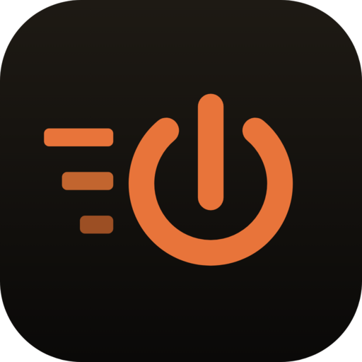

  

<h3 align="center">PwrDrvr LLC</h3>

Open-source desktop tools for the agent-era developer

  <a href="https://pwrdrvr.com">pwrdrvr.com</a> ·
  <a href="https://pwrdrvr.com/about">about</a> ·
  <a href="https://www.linkedin.com/company/pwrdrvr/">linkedin</a> ·
  <a href="https://x.com/pwrdrvr">@pwrdrvr</a>

---

### Products

Desktop apps for people who write code with an agent sitting next to them. Free,
MIT-licensed, and running entirely on your machine — no account to create, no
telemetry, and no PwrDrvr-operated server in the request path. macOS builds are
Developer ID-signed and Apple-notarized under PwrDrvr LLC.

| Product | | |
|---|---|---|
| [**PwrAgent**](https://github.com/pwrdrvr/PwrAgent) | Your coding agent runs on your laptop; you drive it from your phone. Pair it once with Telegram, Discord, Slack, Mattermost, Feishu / Lark, or LINE, then start, resume, steer, and approve from wherever you are. | [pwragent.ai](https://pwragent.ai) · [docs](https://docs.pwragent.ai) |
| [**PwrSnap**](https://github.com/pwrdrvr/PwrSnap) | Screen capture that respects your time and your sensitive data. Drag a region and it is on your clipboard in under a second; optional AI drafts the arrows and blurs the API key it spots. | [pwrsnap.com](https://pwrsnap.com) · [docs](https://docs.pwrsnap.com) |
| **PwrGit** | Coming soon. | |

The optional AI features ride the agent you already have — your installed
Codex / ChatGPT app and subscription, or Kimi, Qwen, or Grok Build over ACP —
billed to the plan you already pay for. No PwrDrvr API key, ever.

### Open-source projects

Libraries and tools we maintain in the open, mostly AWS and Node.js
infrastructure written because production needed them.

| Project | Description |
|---------|-------------|
| [**Lambda Dispatch**](https://github.com/pwrdrvr/lambda-dispatch) | High-performance request router for AWS Lambda — concurrent request handling within a single invocation, reducing cold starts and improving throughput |
| [**MicroApps**](https://github.com/pwrdrvr/microapps-core) | Framework for deploying and routing independently-versioned micro-frontend applications on AWS |
| [**ghcrawl**](https://github.com/pwrdrvr/ghcrawl) | Terminal UI for crawling GitHub issues and PRs, generating embeddings, and clustering related work |
| [**OpenClaw Codex App Server**](https://github.com/pwrdrvr/openclaw-codex-app-server) | An OpenClaw plugin bridging the Codex App Server protocol to Telegram and Discord |

---

  
    PwrDrvr LLC · Holmdel, New Jersey · founded 2017 · <a href="https://pwrdrvr.com/about">who we are</a> 
    Independent software. Codex is a product of OpenAI; PwrDrvr LLC is not affiliated with or endorsed by OpenAI.
  

